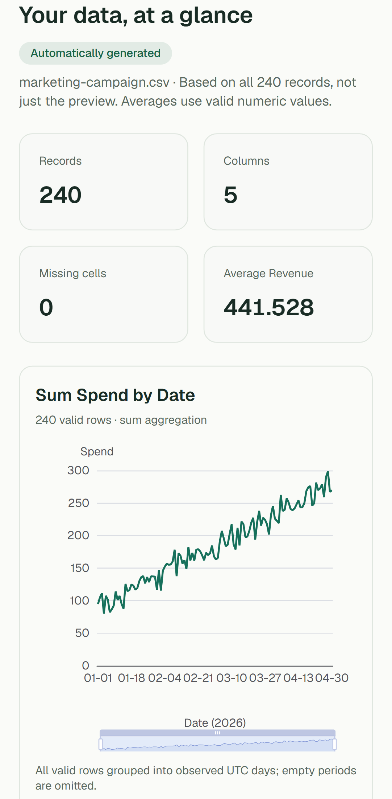
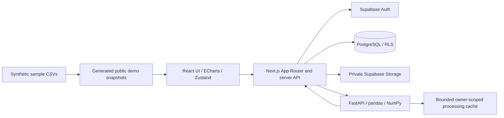

# Narra

**Turn raw datasets into understandable dashboards.**

Narra examines a CSV, detects its schema, calculates statistics, recommends useful
charts, and explains patterns through deterministic calculations. It is a full-stack
analytics MVP, not a manual chart builder. There is no AI or LLM integration.

Stages 1–17 are implemented. Local unit, database-policy, build, and public browser
checks pass. The Supabase migrations are applied and the public Vercel/Render demo
is verified. **Hosted account → saved-dataset lifecycle verification remains
pending:** configure a disposable confirmed test account and run the lifecycle test.
See [verification](docs/stage-17-verification.md).

## Screenshots

Actual Chromium captures of the public demo, calculated from synthetic sample CSVs:


<details>
<summary>Mobile dashboard</summary>



</details>

## Features

- Email/password registration, confirmation, login, logout, and protected workspaces.
- Owner-only projects with creation, rename, deletion, and Supabase persistence.
- Drag-and-drop UTF-8 CSV upload with byte limits and actionable validation errors.
- Numeric, categorical, datetime, boolean, and text inference from the full dataset.
- Missing-value analysis; numeric, categorical, and datetime summary statistics.
- Up to six ranked ECharts line, bar, scatter, histogram, and donut visualizations.
- Traceable trend, category-frequency, Pearson correlation, and IQR outlier insights.
- Category multiselect, numeric bounds, and inclusive date filters across all outputs.
- Bounded, searchable, sortable, paginated previews; chart data alternatives.
- Private CSV Storage, relational metadata, saved dashboard snapshots, and cache restoration.
- Responsive layouts, keyboard controls, loading/error states, and public demo datasets.

V1 supports **one immutable CSV per project**, 4 MiB by default, 100,000 data rows,
and 200 columns. Filters are an exploration view; reopening restores the original
saved analysis. Create another project for a different dataset.

## Demo

Run the frontend and open [the local demo](http://localhost:3000/demo). No account
is required. Choose ecommerce, student, marketing, traffic, or weather data and
inspect automatically generated charts. Each sample has 240 fictional records.

The initial snapshots are generated by Narra's actual Python pipeline and work
without Supabase or FastAPI. **Applying filters requires FastAPI.** Download any
sample and upload it into a private project to save your own copy. The landing
page's illustrative preview is separate from this working demo.

[Open the live demo](https://narra-web-bay.vercel.app/demo) ·
[Sample provenance and regeneration](sample-data/README.md).

## Architecture



Next.js verifies identity and project ownership, handles persistence, and centralizes
API calls. FastAPI owns parsing and analytics services, with no direct database
writes. PostgreSQL independently enforces ownership through RLS; private Storage
has its own owner-scoped policies. Cache tokens never authorize access alone.

[Architecture and data model](docs/architecture.md) ·
[Persistence decisions](docs/stage-14-design.md) ·
[Historical stage decisions](docs/stage-decisions.md)

```text
apps/web/          Next.js app, feature components, API clients, stores, tests
apps/analytics/    FastAPI routes, schemas, independent services, pytest tests
packages/          Reserved shared UI/contracts boundaries
supabase/          Versioned database and Storage policy migrations
sample-data/       Five reproducible synthetic CSV datasets
scripts in apps/   Demo generation and standalone web startup
```

## Tech stack

| Layer               | Technologies                                                          |
| ------------------- | --------------------------------------------------------------------- |
| Frontend            | Next.js App Router, React, strict TypeScript, Tailwind CSS, shadcn/ui |
| Visualization/state | Apache ECharts, Zustand, Zod                                          |
| Analytics           | Python 3.13, FastAPI, pandas, NumPy, Pydantic                         |
| Identity/storage    | Supabase Auth, PostgreSQL RLS, Supabase Storage                       |
| Tests               | pytest, Ruff, Vitest, React Testing Library, PGlite, Playwright, axe  |
| Tooling/deployment  | pnpm workspaces, uv, Docker Compose, GitHub Actions                   |

Exact versions are pinned in package manifests and lockfiles.

## Local development

Prerequisites: Node.js 24, pnpm 11.19.0, Python 3.13, and uv 0.12.8 or compatible.

```sh
git clone https://github.com/beep-anjero/Narra.git
cd Narra
npm install --global pnpm@11.19.0
pnpm install --frozen-lockfile
uv sync --directory apps/analytics --locked
```

Configure the local environment files below, then use two terminals:

```sh
pnpm analytics:dev
pnpm dev
```

Open [localhost:3000](http://localhost:3000). Marketing and the initial demo work
without account configuration. For the production server:

```sh
pnpm build
pnpm start
```

The start script prepares static assets and starts Next.js's standalone server.
`PORT` and `HOSTNAME` can override its listening address.

## Environment variables

Use [`.env.example`](.env.example). Next.js reads **apps/web/.env.local**;
FastAPI reads **apps/analytics/.env**. A root `.env` is used only by Docker Compose.

| Variable                               | Location     | Purpose                                                |
| -------------------------------------- | ------------ | ------------------------------------------------------ |
| `NEXT_PUBLIC_SUPABASE_URL`             | Web          | Supabase project URL                                   |
| `NEXT_PUBLIC_SUPABASE_PUBLISHABLE_KEY` | Web          | Public key; RLS remains mandatory                      |
| `ANALYTICS_API_URL`                    | Web server   | FastAPI base URL, normally `http://127.0.0.1:8000`     |
| `ANALYTICS_API_KEY`                    | Both servers | Identical private random key, at least 32 characters   |
| `MAX_UPLOAD_SIZE_BYTES`                | Both servers | Default 4 MiB; align Storage/proxy limits              |
| `MAX_DATASET_ROWS`                     | Analytics    | Default 100,000 data rows                              |
| `CORS_ORIGINS`                         | Analytics    | JSON array; server-to-server calls do not require CORS |
| `NUMERIC_PARSE_THRESHOLD`              | Analytics    | Default 0.9                                            |
| `DATETIME_PARSE_THRESHOLD`             | Analytics    | Default 0.9                                            |
| `CATEGORICAL_UNIQUE_RATIO_THRESHOLD`   | Analytics    | Default 0.5                                            |
| `SCHEMA_SAMPLE_SIZE`                   | Analytics    | Default 5, maximum 5                                   |

Generate a random service key locally, for example with Python's
`secrets.token_urlsafe(32)`. Never commit local environment files or expose a private
key with a `NEXT_PUBLIC_` prefix. The application requires no Supabase service-role key.

## Database setup

Create a Supabase project, configure email/password Auth and its Site URL, then
apply these SQL files **in order** through SQL Editor or the Supabase CLI:

1. `20260907000100_auth_profiles.sql`
2. `20260908000100_projects.sql`
3. `20260913000100_datasets.sql`
4. `20260914000100_limit_uploads_for_vercel.sql`

The third migration creates the private `datasets` bucket, dataset-related tables,
transactional save function, and deletion guard. The fourth aligns the private
bucket with the deployed 4 MiB request limit. Change the bucket and both services
together if raising it. Detailed instructions, confirmation links, and hosted
verification steps are in [Supabase setup](docs/supabase-setup.md).

## Analytics pipeline

```text
Validate CSV → Infer schema → Calculate statistics → Rank charts
             → Prepare bounded chart data → Generate insights → Save → Explore
```

Validation rejects non-CSV files, empty data, unreadable encoding, missing/duplicate
headers, malformed records, and limit violations. Inference uses full-data parse
ratios, conservative boolean/name hints, complete calendar dates, and cardinality.
Blank values are missing; literal `NA` and `NULL` strings are preserved.

Numeric summaries use finite values, sample standard deviation, and linear
quartiles. Correlation uses paired valid values and never asserts causation.
Potential outliers use `Q1 − 1.5 × IQR` and `Q3 + 1.5 × IQR`; they are not removed.
Monthly changes require consecutive observed months and a nonzero baseline.

Previews have at most 100 rows. Charts have bounded aggregates; scatter data is
explicitly sampled at 500 points. Filtering runs on the complete dataset. The
15-minute, eight-entry, 128 MiB DataFrame cache is temporary; saved CSVs rehydrate
it when necessary. See [analytics details](apps/analytics/README.md) for exact limits.

## Visualization recommendation logic

| Compatible columns       | Candidate      |
| ------------------------ | -------------- |
| Date + numeric           | Line           |
| Category + numeric       | Bar            |
| Numeric + numeric        | Scatter        |
| Numeric                  | Histogram      |
| Category with 2–8 values | Donut          |
| Date + records           | Frequency line |

Scores combine compatibility, cardinality, valid-row coverage, sample size, and
conservative name hints. They express recommendation confidence, not statistical
truth. Stable ordering selects up to six charts, at most two of each type, excluding
constant or likely identifier columns. The UI explains each recommendation.

## Testing

```sh
pnpm check:all
pnpm --filter @narra/web exec playwright install chromium
pnpm test:e2e
```

Vitest includes component, API, auth, and actual PostgreSQL migration/RLS tests.
Playwright starts both real servers and tests the public demo on desktop/mobile,
including live filtering and accessibility. CI runs the same checks.

`pnpm test:e2e:lifecycle` explicitly runs the account/upload/save/reopen/delete
flow using a disposable configured account. Optional registration is supported for
local Supabase test environments. It does not silently skip missing credentials.
See [testing guide](docs/testing.md) and [verification status](docs/stage-17-verification.md).

## Deployment

Dockerfiles and `compose.yaml` provide a Node standalone frontend and a separate,
non-root Python analytics service. Put Compose values in an ignored root `.env`:

```sh
docker compose build
docker compose up -d
```

The hosted frontend runs on [Vercel](https://narra-web-bay.vercel.app/) and the
analytics service runs on Render. The public demo and cross-service filtering are
verified. Production uses a 4 MiB upload limit to stay below Vercel's request ceiling.
Docker execution remains unverified on this machine. See [deployment guide](docs/deployment.md).

## Roadmap

V1 implementation ends here. The authenticated hosted lifecycle test is the remaining
release check. No V2 functionality was added.

Future work can add Excel, Google Sheets, dashboard customization, PDF reports,
public sharing, or multiple datasets. Natural-language explanations and forecasting
would be separate later work, with explicit uncertainty and security design.
