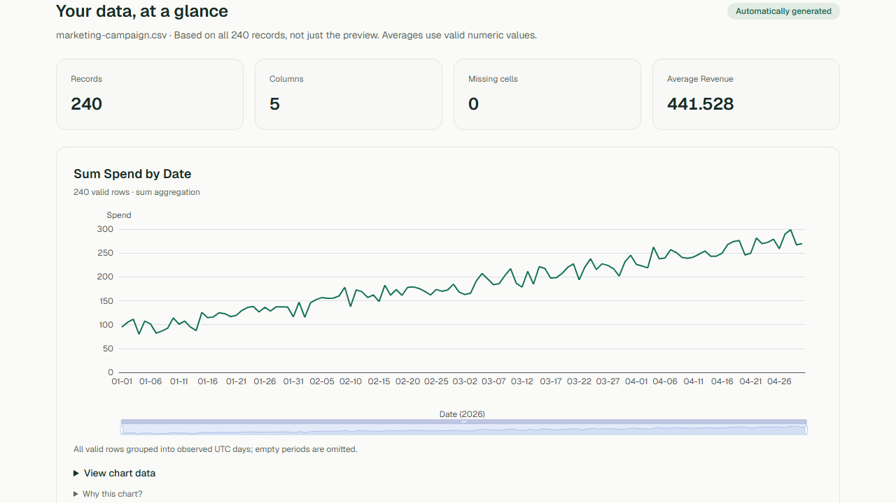

# Narra

**Turn a CSV into a dashboard you can understand.**

Narra is a data exploration app for people who want useful answers from a dataset
without building charts by hand. Upload a CSV and Narra automatically identifies
the columns, summarizes the data, recommends visualizations, and explains notable
patterns with traceable calculations.

Narra is useful for quickly exploring exports such as sales records, campaign
results, student performance, website traffic, or weather history. It uses a
deterministic analytics pipeline—no AI or LLM is required to analyze your data.

> **MVP status:** Narra is an early-stage minimum viable product. It is intended
> for lightweight CSV exploration and does not yet replace a full business
> intelligence or statistical analysis platform.



_The screenshot shows a fictional ecommerce sample dataset. Revenue figures and
other values are demonstration data, not Narra company or product metrics._

## What Narra does

- Detects numeric, categorical, date, boolean, and text columns.
- Summarizes values, missing data, distributions, and date ranges.
- Generates ranked line, bar, scatter, histogram, and donut charts.
- Highlights trends, common categories, correlations, and potential outliers.
- Lets you filter the full dataset by category, number, or date.
- Provides searchable, sortable, and paginated data previews.
- Saves private datasets and dashboards to your account.

## MVP limitations

- CSV files only; Excel and Google Sheets are not supported.
- One immutable dataset per project; upload changes require a new project.
- A default maximum file size of 25 MiB, 100,000 data rows, and 200 columns.
- Filters are temporary exploration views; reopening a project restores the
  original saved analysis.
- Charts are selected automatically and cannot yet be manually customized.
- No forecasting, natural-language querying, PDF reports, or public dashboard
  sharing.
- Generated insights are descriptive calculations, not causal conclusions or
  professional financial, scientific, or statistical advice.

## Try it

Open the [live demo](https://narra-web-bay.vercel.app/demo) to explore five
fictional datasets without creating an account. Choose ecommerce, student,
marketing, traffic, or weather data to see the dashboard Narra generates.

To analyze your own data:

1. Create and confirm an account.
2. Create a project.
3. Upload a UTF-8 CSV file.
4. Review the generated summary, charts, insights, and data preview.
5. Apply filters to explore a subset of the data.

Filters change the current exploration view. Reopening a saved project restores
the original analysis.

## Run Narra locally

### Requirements

- Node.js 24
- pnpm 11.19.0
- Python 3.13
- uv 0.12.8 or compatible

### Install

```sh
git clone https://github.com/beep-anjero/Narra.git
cd Narra
npm install --global pnpm@11.19.0
pnpm install --frozen-lockfile
uv sync --directory apps/analytics --locked
```

### Configure

Copy the values from [`.env.example`](.env.example) into these files:

- `apps/web/.env.local` for the web app
- `apps/analytics/.env` for the analytics service

The landing page and initial demo dashboards work without Supabase. Accounts,
projects, uploads, and saved dashboards require a Supabase project. Follow the
[Supabase setup guide](docs/supabase-setup.md) to configure authentication,
database migrations, and private file storage.

Use the same private `ANALYTICS_API_KEY` in both environment files. You can generate
one with:

```sh
python -c "import secrets; print(secrets.token_urlsafe(32))"
```

### Start

Run the analytics service and web app in separate terminals:

```sh
pnpm analytics:dev
```

```sh
pnpm dev
```

Then open [http://localhost:3000](http://localhost:3000). The demo is available at
`/demo`. The analytics service is needed when uploading or filtering data.

## Verify your setup

```sh
pnpm check:all
```

For browser tests:

```sh
pnpm --filter @narra/web exec playwright install chromium
pnpm test:e2e
```

## Project structure

```text
apps/web/          Next.js interface and server routes
apps/analytics/    FastAPI CSV analysis service
supabase/          Database and private storage migrations
sample-data/       Reproducible fictional demo datasets
docs/              Setup, architecture, testing, and deployment guides
```

For more detail, see the [architecture](docs/architecture.md),
[analytics documentation](apps/analytics/README.md), [testing guide](docs/testing.md),
and [deployment guide](docs/deployment.md).
