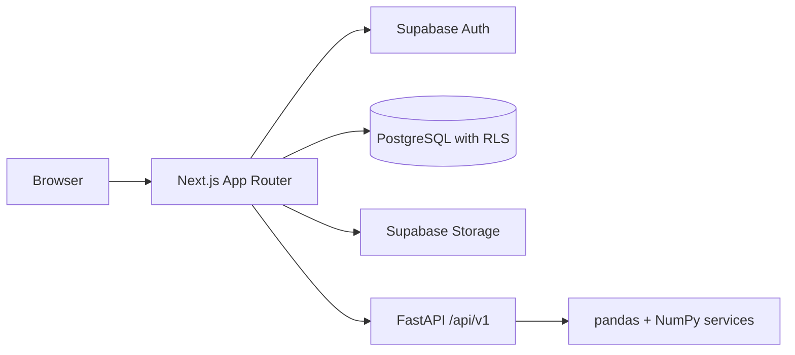

# Architecture

## Status

Stages 1–3 establish the frontend, marketing page, and Supabase authentication
implementation. Only `apps/web` is executable. The initial profile migration is
tested locally; hosted setup and real account verification await a Supabase project.
Project CRUD, analytics, and CSV storage remain later-stage work.

## Planned service boundaries

Next.js will own the UI and server-side integration/persistence layer. FastAPI will
own deterministic analytics with no direct persistence. Supabase will supply
identity, relational storage, and private CSV storage. Server-side ownership checks
and RLS will enforce user isolation when these integrations are implemented.

## Foundation decisions

- Use pnpm workspaces with exact direct dependencies and a committed lockfile.
  Root scripts delegate to the web workspace. A task orchestrator is unnecessary
  for the current single executable application.
- Standardize development on Node.js 24 and pin pnpm to 11.19.0. `.node-version`
  records the verified local Node version.
- Use the Next.js App Router with server components by default. Add client
  components only for interactions when features need them.
- Enable TypeScript strict mode and checked indexed access. Keep the `@/*` alias
  scoped to `apps/web`, so feature imports remain straightforward.
- Configure Tailwind CSS v4 through PostCSS and shared CSS theme tokens. Stage 2
  uses a forest-green palette and a locally bundled Geist variable font, avoiding
  external font requests at build time and runtime.
- Configure shadcn/ui with the New York style, React Server Components support,
  local component aliases, and a `cn` helper. Stage 2 adds only Button, Card, Badge,
  Dialog, and Sheet, with their required dependencies.
- Keep shared-package directories reserved until code has a real second consumer.
  No empty JavaScript packages or duplicate UI implementations are needed now.
- Run ESLint separately from `next build`, with Next.js Core Web Vitals and
  TypeScript rules. Prettier owns formatting. Warnings fail the lint command.
  ESLint 9 is pinned because the React lint plugin used by Next.js currently
  declares support through ESLint 9. The registry marks that major deprecated;
  upgrade once the plugin supports ESLint 10 rather than override peer constraints.
- Environment variables in `.env.example` document integration boundaries.
  Stage 3 consumes the two public Supabase settings from `apps/web/.env.local`;
  private keys must never use `NEXT_PUBLIC_`.

## Frontend organization

| Directory    | Responsibility                                       |
| ------------ | ---------------------------------------------------- |
| `app`        | Routes, root layout, metadata, and global styles     |
| `components` | Reusable UI; shadcn components under `components/ui` |
| `features`   | Feature-specific components, hooks, and logic        |
| `hooks`      | Hooks reused across features                         |
| `lib/api`    | Future centralized server/API integration            |
| `lib`        | Cross-feature utilities                              |
| `stores`     | Future shared dashboard state when needed            |
| `types`      | Application-wide TypeScript types                    |
| `tests`      | Future component, integration, and E2E tests         |

## Verification strategy

Run `pnpm check` for formatting, lint, TypeScript, component tests, and a production
build. Vitest/React Testing Library cover forms and navigation. Node-based tests
cover auth actions, confirmation, and route guards. PGlite executes the real SQL
migration against PostgreSQL with minimal fixtures for Supabase's owned Auth schema.
Provider mocks are confined to tests. Hosted Supabase and email delivery require
separate live verification. pytest and Playwright remain later-stage work.

## Stage 2 boundaries

- Marketing components live in `features/marketing`. The page composes sections;
  UI primitives and the reusable brand remain in `components`.
- In Stage 2, only the header/drawer and availability dialogs needed client behavior. Marketing
  copy and the dashboard illustration render on the server.
- Preview values live in a small, explicitly illustrative fixture. The SVG and
  category bars depict those values without introducing ECharts or an analytics
  implementation before their stages. An accessible table exposes exact monthly
  values; the chart scrolls within its card on small screens to keep labels legible.
- Stage 2 used an availability dialog for the primary CTA. Stage 3 connects it to
  registration and adds login links. The demo CTA still points to the labeled
  static preview; upload, filtering, persistence, and the working demo are deferred.
- The theme uses restrained surfaces, responsive grids, visible focus styles,
  reduced-motion support, and accessible Radix dialog/drawer behavior.
- The Next.js development server generates local `AGENTS.md` and `CLAUDE.md` files.
  They are retained as generated guidance, as requested by their own instructions.
- Deployment is outside the user's stage-by-stage scope. No hosting project,
  static-export conversion, or infrastructure change is introduced in Stage 2.

## Stage 3 decisions

- `features/auth` owns validation, provider-error translation, actions, form UI,
  and the reusable `requireUser` guard. `lib/supabase` owns SDK configuration,
  server cookie adapters, and request session refresh. Components do not call the
  Supabase SDK directly.
- Server Actions use Zod before contacting Supabase and preserve password whitespace.
  Registration enforces eight characters and confirmation. Login accepts existing
  shorter passwords; signup requirements do not unexpectedly lock out older accounts.
- Next.js `proxy.ts` uses verified `getClaims()` to refresh and check sessions.
  Refreshed/deleted cookies survive redirects and are forwarded to both server
  rendering and the browser. Auth responses are private and not cached.
- Protected server components independently call `getUser()` through a React
  request-scoped cache. Proxy is not the sole authorization boundary. Future data
  actions must call this guard themselves; a layout alone does not authorize them.
- Cookie writes are enabled explicitly for actions and handlers. Server components
  read cookies, relying on Proxy to persist refreshes. There is no broad catch that
  silently discards failed cookie writes from login or logout.
- Auth mutations use Next.js Server Actions with their same-origin protections;
  logout is a form POST, never a GET endpoint. It ends the current browser session
  and invalidates the router cache. No home-grown session or password store exists.
- Return destinations are limited to same-origin dashboard/project paths. Email
  templates use Supabase's configured Site URL. `/auth/confirm` supports only
  signup email confirmation; OAuth can later be added at the isolated auth boundary.
- `public.profiles` references `auth.users`, supports existing-user backfill, and
  synchronizes emails via a security-definer trigger with an empty search path.
  Authenticated clients have only owner-scoped SELECT; all profile writes are denied.
  There are no user-editable profile fields yet, so no update policy is needed.
- The only new database is a development-only embedded PostgreSQL test instance.
  Application persistence remains Supabase. Project schemas, storage buckets, and
  their ownership policies will be implemented in their respective stages.
- Missing or invalid Supabase settings disable auth forms and redirect protected
  requests to login. They never grant a mock session or weaken authorization.

## Next stage

Connect Supabase and finish the live Stage 3 checklist in `docs/supabase-setup.md`.
Stage 4 adds project management, migrations, and ownership policies after explicit
instruction. No Stage 4 work has been started.
