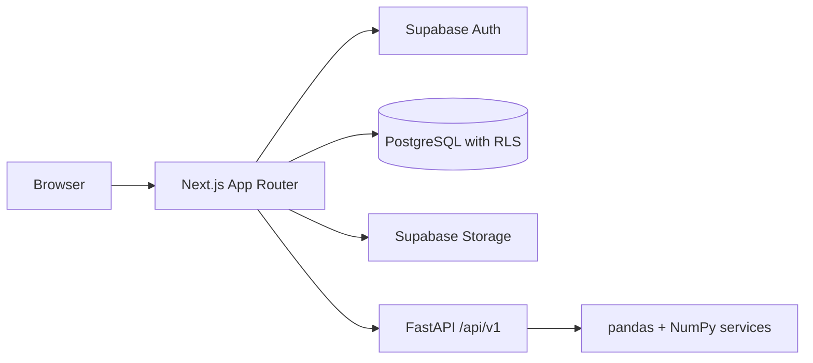

# Architecture

## Status

Stage 1 establishes a runnable Next.js frontend and repository conventions. Only
`apps/web` is executable. The remaining directories reserve the requested structure;
no authentication, analytics, storage, or database functionality is implemented yet.

## Planned service boundaries

Next.js will own the UI and server-side integration/persistence layer. FastAPI will
own deterministic analytics with no direct persistence. Supabase will supply
identity, relational storage, and private CSV storage. Server-side ownership checks
and RLS will enforce user isolation when these integrations are implemented.

## Foundation decisions

- Use pnpm workspaces with exact direct dependencies and a committed lockfile.
  Root scripts delegate to the web workspace. A task orchestrator is unnecessary
  for the current single executable application.
- Standardize development on Node.js 24 and pin pnpm to 11.19.0. `.node-version`
  records the verified local Node version.
- Use the Next.js App Router with server components by default. Add client
  components only for interactions when features need them.
- Enable TypeScript strict mode and checked indexed access. Keep the `@/*` alias
  scoped to `apps/web`, so feature imports remain straightforward.
- Configure Tailwind CSS v4 through PostCSS and CSS theme tokens. Use a neutral
  light palette and system fonts for now; branding belongs to Stage 2. Builds do
  not download fonts or require external application services.
- Configure shadcn/ui with the New York style, React Server Components support,
  local component aliases, and a `cn` helper. Add components and their actual
  dependencies as needed in Stage 2 instead of preinstalling an entire UI catalog.
- Keep shared-package directories reserved until code has a real second consumer.
  No empty JavaScript packages or duplicate UI implementations are needed now.
- Run ESLint separately from `next build`, with Next.js Core Web Vitals and
  TypeScript rules. Prettier owns formatting. Warnings fail the lint command.
  ESLint 9 is pinned because the React lint plugin used by Next.js currently
  declares support through ESLint 9. The registry marks that major deprecated;
  upgrade once the plugin supports ESLint 10 rather than override peer constraints.
- Environment variables in `.env.example` document future integration boundaries.
  No variable is required or consumed in Stage 1. Next.js local configuration will
  live in `apps/web/.env.local`; private keys must never use `NEXT_PUBLIC_`.

## Frontend organization

| Directory    | Responsibility                                       |
| ------------ | ---------------------------------------------------- |
| `app`        | Routes, root layout, metadata, and global styles     |
| `components` | Reusable UI; shadcn components under `components/ui` |
| `features`   | Feature-specific components, hooks, and logic        |
| `hooks`      | Hooks reused across features                         |
| `lib/api`    | Future centralized server/API integration            |
| `lib`        | Cross-feature utilities                              |
| `stores`     | Future shared dashboard state when needed            |
| `types`      | Application-wide TypeScript types                    |
| `tests`      | Future component, integration, and E2E tests         |

## Verification strategy

For this configuration-only stage, verify formatting, lint, TypeScript, a production
build, and an HTTP smoke check of the production server. Feature tests will use
pytest, Vitest/React Testing Library, and Playwright in their corresponding stages.
Do not treat the reserved test directories as completed tests.

## Next stage

Stage 2: Narra branding, navbar, marketing landing page, reusable UI primitives,
and responsive behavior. Authentication and analytics remain subsequent stages.
