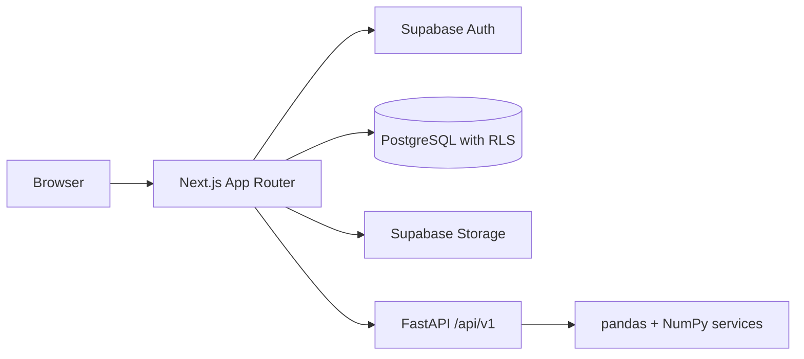

# Architecture

## Stage 6 upload boundary

The browser sends one raw CSV body to an owned project's Next.js Route Handler.
The handler checks same-origin requests, verifies the session and project owner,
and forwards bounded bytes through a centralized analytics client. FastAPI requires
a server-only shared API key and independently validates byte limits and CSV content.
This keeps Supabase authorization in Next.js and prevents unauthenticated direct
processing. The key must never use a NEXT_PUBLIC prefix.

The upload handler uses a single writable Supabase client for identity verification
and ownership queries, persisting refreshed cookies itself. Upload API paths are
excluded from Next.js Proxy to avoid its request-cloning buffer and default 10 MiB
truncation. Authorization is enforced inside the handler before consuming bytes.

Raw CSV transport avoids multipart buffering before authentication and lets both
servers enforce actual streamed byte counts even without Content-Length. The file
name is percent-encoded in X-Filename; the body retains the original CSV bytes.
Parsing runs off the ASGI event loop. A strict CSV pass validates every record before
pandas builds a limited preview. All preview cells remain strings. Stage 7 adds
full-dataset type inference as described below. Stage 6 retains no uploaded
data in the database, storage, or browser storage. Reloading clears the preview.

## Status

Stages 1–7 establish the frontend, marketing page, Supabase authentication,
owner-protected project management, validated CSV previews, and full-dataset schema
inference. Both applications are executable independently. Hosted database verification
remains pending; statistics, charts, and CSV storage remain later-stage work.

## Planned service boundaries

Next.js will own the UI and server-side integration/persistence layer. FastAPI will
own deterministic analytics with no direct persistence. Supabase will supply
identity, relational storage, and private CSV storage. Server-side ownership checks
and RLS will enforce user isolation when these integrations are implemented.

## Foundation decisions

- Use pnpm workspaces with exact direct dependencies and a committed lockfile.
  Root scripts delegate to the web workspace. A task orchestrator is unnecessary
  for the current single executable application.
- Standardize development on Node.js 24 and pin pnpm to 11.19.0. `.node-version`
  records the verified local Node version.
- Use the Next.js App Router with server components by default. Add client
  components only for interactions when features need them.
- Enable TypeScript strict mode and checked indexed access. Keep the `@/*` alias
  scoped to `apps/web`, so feature imports remain straightforward.
- Configure Tailwind CSS v4 through PostCSS and shared CSS theme tokens. Stage 2
  uses a forest-green palette and a locally bundled Geist variable font, avoiding
  external font requests at build time and runtime.
- Configure shadcn/ui with the New York style, React Server Components support,
  local component aliases, and a `cn` helper. Stage 2 adds only Button, Card, Badge,
  Dialog, and Sheet, with their required dependencies.
- Keep shared-package directories reserved until code has a real second consumer.
  No empty JavaScript packages or duplicate UI implementations are needed now.
- Run ESLint separately from `next build`, with Next.js Core Web Vitals and
  TypeScript rules. Prettier owns formatting. Warnings fail the lint command.
  ESLint 9 is pinned because the React lint plugin used by Next.js currently
  declares support through ESLint 9. The registry marks that major deprecated;
  upgrade once the plugin supports ESLint 10 rather than override peer constraints.
- Environment variables in `.env.example` document integration boundaries.
  Stage 3 consumes the two public Supabase settings from `apps/web/.env.local`;
  private keys must never use `NEXT_PUBLIC_`.

## Frontend organization

| Directory    | Responsibility                                       |
| ------------ | ---------------------------------------------------- |
| `app`        | Routes, root layout, metadata, and global styles     |
| `components` | Reusable UI; shadcn components under `components/ui` |
| `features`   | Feature-specific components, hooks, and logic        |
| `hooks`      | Hooks reused across features                         |
| `lib/api`    | Future centralized server/API integration            |
| `lib`        | Cross-feature utilities                              |
| `stores`     | Future shared dashboard state when needed            |
| `types`      | Application-wide TypeScript types                    |
| `tests`      | Future component, integration, and E2E tests         |

## Verification strategy

Run `pnpm check` for formatting, lint, TypeScript, component tests, and a production
build. Vitest/React Testing Library cover forms and navigation. Node-based tests
cover auth actions, confirmation, and route guards. PGlite executes the real SQL
migration against PostgreSQL with minimal fixtures for Supabase's owned Auth schema.
Provider mocks are confined to tests. Hosted Supabase and email delivery require
separate live verification. pytest now covers the analytics foundation; Playwright
remains later-stage work.

## Stage 2 boundaries

- Marketing components live in `features/marketing`. The page composes sections;
  UI primitives and the reusable brand remain in `components`.
- In Stage 2, only the header/drawer and availability dialogs needed client behavior. Marketing
  copy and the dashboard illustration render on the server.
- Preview values live in a small, explicitly illustrative fixture. The SVG and
  category bars depict those values without introducing ECharts or an analytics
  implementation before their stages. An accessible table exposes exact monthly
  values; the chart scrolls within its card on small screens to keep labels legible.
- Stage 2 used an availability dialog for the primary CTA. Stage 3 connects it to
  registration and adds login links. The demo CTA still points to the labeled
  static preview; upload, filtering, persistence, and the working demo are deferred.
- The theme uses restrained surfaces, responsive grids, visible focus styles,
  reduced-motion support, and accessible Radix dialog/drawer behavior.
- The Next.js development server generates local `AGENTS.md` and `CLAUDE.md` files.
  They are retained as generated guidance, as requested by their own instructions.
- Deployment is outside the user's stage-by-stage scope. No hosting project,
  static-export conversion, or infrastructure change is introduced in Stage 2.

## Stage 3 decisions

- `features/auth` owns validation, provider-error translation, actions, form UI,
  and the reusable `requireUser` guard. `lib/supabase` owns SDK configuration,
  server cookie adapters, and request session refresh. Components do not call the
  Supabase SDK directly.
- Server Actions use Zod before contacting Supabase and preserve password whitespace.
  Registration enforces eight characters and confirmation. Login accepts existing
  shorter passwords; signup requirements do not unexpectedly lock out older accounts.
- Next.js `proxy.ts` uses verified `getClaims()` to refresh and check sessions.
  Refreshed/deleted cookies survive redirects and are forwarded to both server
  rendering and the browser. Auth responses are private and not cached.
- Protected server components independently call `getUser()` through a React
  request-scoped cache. Proxy is not the sole authorization boundary. Future data
  actions must call this guard themselves; a layout alone does not authorize them.
- Cookie writes are enabled explicitly for actions and handlers. Server components
  read cookies, relying on Proxy to persist refreshes. There is no broad catch that
  silently discards failed cookie writes from login or logout.
- Auth mutations use Next.js Server Actions with their same-origin protections;
  logout is a form POST, never a GET endpoint. It ends the current browser session
  and invalidates the router cache. No home-grown session or password store exists.
- Return destinations are limited to same-origin dashboard/project paths. Email
  templates use Supabase's configured Site URL. `/auth/confirm` supports only
  signup email confirmation; OAuth can later be added at the isolated auth boundary.
- `public.profiles` references `auth.users`, supports existing-user backfill, and
  synchronizes emails via a security-definer trigger with an empty search path.
  Authenticated clients have only owner-scoped SELECT; all profile writes are denied.
  There are no user-editable profile fields yet, so no update policy is needed.
- The only new database is a development-only embedded PostgreSQL test instance.
  Application persistence remains Supabase. Project schemas, storage buckets, and
  their ownership policies will be implemented in their respective stages.
- Missing or invalid Supabase settings disable auth forms and redirect protected
  requests to login. They never grant a mock session or weaken authorization.

## Stage 4 decisions

- Projects reference profiles and cascade on account deletion. An indexed owner and
  updated timestamp support paginated workspace queries (12 projects per page).
- Server Actions validate names, descriptions, IDs, and deletion confirmation.
  The centralized server-only `lib/api/projects.ts` obtains a verified user.
  Reads, updates, and deletes include owner filters; inserts derive ownership from
  the session. Database RLS independently enforces all four operations.
- Column-level grants prohibit transferring ownership or forging timestamps.
  A database trigger updates `updated_at` for every edit.
- Server-rendered project pages read persistent Supabase data on each request;
  successful mutations invalidate affected routes. No global client store is needed.
- Project settings use the existing UI primitives and a native labeled textarea.
  Uploads and analytics are explicitly deferred, with honest empty project states.
- PostgreSQL tests execute both actual migrations. Action and component tests use
  provider doubles only in tests; production has no mock persistence or bypass.

## Next stage

Apply the projects migration and verify the hosted project lifecycle described in
`docs/supabase-setup.md`. Stage 11 adds chart rendering and KPIs only
after explicit instruction.

## Stage 10 decisions

- `visualization_recommender.py` independently evaluates full-data valid values
  using shared numeric/date parsing. Constant, text, and likely identifier columns
  are excluded. Paired charts must have overlapping valid rows with variation.
- Recommendation scoring combines type compatibility, cardinality eligibility,
  valid-row coverage, sample size, and conservative aggregation name hints.
  It does not calculate correlations or make claims about statistical significance.
- Candidate columns are bounded before pair generation; ranked results are capped
  at six, with at most two per chart type. Stable iteration and sorting make ties
  deterministic. Rules, limits, and score weights are documented in the analytics README.
- The analysis response includes typed recommendations without an additional CSV
  upload. The dedicated endpoint shares parsing/inference but avoids unnecessary
  statistics computation. The statistics endpoint likewise skips recommendations.
- The web contract retains and validates recommendation axes and aggregations.
  No rendering, chart aggregation, persistence, dependency, or migration is added.

## Stage 9 decisions

- The reusable preview renders 10, 25, or 50 rows per page from the existing
  bounded response. It does not fetch or render the entire CSV. Search and natural
  text sorting operate only on those preview rows and never change full-data statistics.
  Sort ties retain source order; blanks stay last in either direction.
- Type badges are shared by the schema table, preview headers, and statistics
  panel. Blank and whitespace-only cells have an explicit Missing label; literal
  NA and original source strings remain visible. Source row numbers survive sorting.
- Local React state is sufficient for pagination, search, sort, and column
  selection. No dashboard store or new dependency is needed yet.
- The statistics panel consumes the typed Stage 8 response. It shows dataset
  completeness and one selected column at a time, including unavailable values,
  invalid-value counts, UTC date bounds, and bounded category frequencies.
- `/project/[id]/data` uses the existing server-side `getProject` ownership check
  and protected layout. It reuses the uploader and exploration components. Data
  remains component-local until the persistence stage, so navigation/reload requires
  another upload; the interface states this explicitly.
- Keyboard controls, labels, table scopes, sort announcements, live page counts,
  and independently scrollable tables support accessibility and narrow layouts.

## Stage 8 decisions

- The existing full-frame analysis pipeline now also calls an independent
  `statistics.py` service. Its `{summary, columns}` result is included in the
  analysis response and available from the authenticated `/datasets/statistics`
  endpoint. Normal uploads still make one analytics request.
- Conversion rules moved into `column_values.py` so inference and statistics
  agree about blanks, finite numbers, and complete dates. Source strings remain
  untouched. Invalid parsed values have separate counts from missing cells.
- Numeric summaries use sample standard deviation and linear quartiles. Scaling
  protects mean/variance calculations from intermediate overflow; quartiles use
  weighted interpolation on sorted original values to preserve small values.
  Undefined or unrepresentable results are null. Float64 precision applies.
- Frequency lists contain at most ten original categories, sorted by frequency
  and then value. Date endpoints are normalized to UTC with elapsed days.
  Dataset completeness counts blank cells and rows without blanks.
- Pydantic uses discriminated column models and rejects non-finite JSON numbers.
  The web Zod contract validates and retains statistics; omission is temporarily
  accepted for rolling deployment with Stage 7 analytics. The visible statistics
  panel and paginated table remain Stage 9 work.
- No schema migration, storage, recommendation algorithm, or new dependency is
  needed for this stage.

## Stage 7 decisions

- `/api/v1/datasets/analyze` returns `{preview, column_metadata}`. The browser's
  existing project upload route now forwards to this endpoint so one file upload
  yields both outputs. `/api/v1/datasets/preview` retains its Stage 6 response.
- Schema inference needs every data row, not just the first 100. The parser's shared
  reader supports a full DataFrame for analysis and a bounded DataFrame for preview.
  Both normalize exactly the same validated CSV records before pandas reads them,
  preserving quoted blanks and whitespace-only records. Existing byte/row limits apply.
- `schema_detector.py` owns classification and column metadata. Routes only compose
  parsing and inference; both run in worker threads. Source values are never changed
  or persisted. Statistics remain a separate Stage 8 service.
- Missing means null, empty, or whitespace-only. Literal NA/NULL/NaN labels are
  preserved. Unique counts and sample values use exact non-missing source strings.
- Precedence is boolean, numeric, datetime, categorical, text. Numeric 0/1 requires
  a boolean-like column name. Complete calendar dates are required before parsing;
  numeric IDs, partial dates, and time-only strings cannot become timestamps.
- Numeric and date matches default to 90% of non-missing values. Categorical unique
  ratio defaults to at most 0.5. All are validated settings. Samples preserve first
  occurrence order, with a configurable limit of 1–5.
- Numeric parsing checks valid grouping and finite values. Date parsing uses UTC
  internally to support mixed offsets without changing the original preview.
  See pandas [numeric coercion](https://pandas.pydata.org/pandas-docs/stable/reference/api/pandas.to_numeric.html)
  and [datetime coercion](https://pandas.pydata.org/pandas-docs/stable/reference/api/pandas.to_datetime.html).

## Stage 5 decisions

- Python 3.13 with uv-managed exact dependencies and a committed lockfile. The
  service uses its own virtual environment; pnpm delegates development and checks.
- FastAPI application factory, `/api/v1` router, strict Pydantic response schemas,
  and a public `/api/v1/health` liveness endpoint. No external I/O or persistence.
- Pydantic Settings reads the service-local `.env` using an absolute path, with
  environment overrides. CORS accepts validated explicit origins and GET only.
  CORS is not authorization; private processing access will be addressed with uploads.
- Current models describe real health and error responses. Dataset schemas and
  pandas/NumPy dependencies are deferred until consumed by working processing code.
- pytest exercises HTTP contracts, OpenAPI, CORS, configuration, and safe errors.
  Ruff handles Python lint and formatting; `pnpm check:all` verifies both runtimes.
- Implementation follows the official [FastAPI router guidance](https://fastapi.tiangolo.com/tutorial/bigger-applications/)
  and [CORS documentation](https://fastapi.tiangolo.com/tutorial/cors/).
