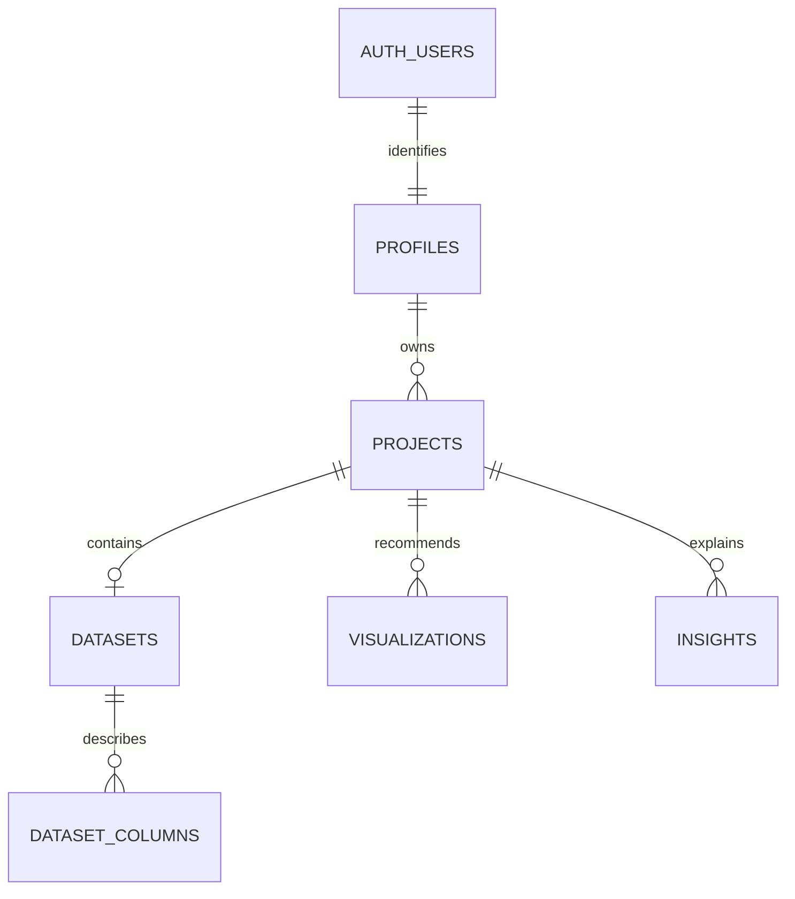

# Architecture

## Boundaries

Next.js owns browser rendering, authentication, authorization, Storage, and database
persistence. Components call centralized API clients; Route Handlers verify Origin,
Supabase identity, and project ownership before reading uploads. Supabase RLS is an
independent authorization boundary. No service-role key is used in application code.

FastAPI exposes `/api/v1/health`, `/datasets/analyze`, `/datasets/preview`,
`/datasets/statistics`, `/datasets/recommend-visualizations`,
`/datasets/generate-insights`, and `/datasets/filter`. Dataset endpoints require a
server-only shared key. Independent services implement every analytics algorithm;
route handlers compose them in worker threads.

## Data model

Each V1 project has at most one dataset. A private UUID-based Storage path belongs
to its user/project; the original filename is display metadata only. Dataset rows
also store a bounded analysis snapshot. Columns, chart configurations, and insight
evidence are normalized into separate relational tables. All child access is
limited to owned projects. Deletes cascade after Storage API cleanup.

One security-invoker PostgreSQL function saves relational records atomically.
Storage upload precedes it; uncertain outcomes are checked before cleanup. Direct
project deletion is blocked while its Storage objects remain. See
[persistence design](stage-14-design.md) for distributed-operation limitations.

## Saved dashboards and filters

Saved snapshots render without downloading the original CSV or running FastAPI.
Cache tokens are excluded from snapshots. On the first filter after reopening,
Next.js downloads the owned CSV and rehydrates analytics state; subsequent requests
send small JSON filters. Expired tokens recover through the same path.

Zustand stores draft/applied filters within each mounted dataset, avoiding shared
state between projects. Apply updates charts, KPIs, preview, statistics, and insights
from one response; failures retain previous results. Source chart choices/types
remain stable. Zero matches are valid. Filters are not saved as a permanent view.

The analytics cache retains at most eight DataFrames totaling 128 MiB, with an
absolute 15-minute lifetime. Expiry cleanup happens on access/insertion. These are
DataFrame limits, not a bound on total process or concurrent request memory. Run a
single worker or expect restoration after cache misses; benchmark larger workloads.

## Public demo

Only five allowlisted synthetic CSVs are exposed. A reproducible generator runs
production analytics services to produce initial snapshots. Filter requests use
server-selected demo scopes, ignoring caller tokens, so this endpoint cannot read
private projects or process arbitrary uploads. Demo API calls still use the private
server-to-server analytics key.

## Deployment and testing

Next.js standalone output traces the monorepo and sample files. The local production
start script copies static assets, and Docker packages them explicitly. Analytics
runs separately as a non-root Python process. The application is not a static export.

PostgreSQL tests validate migrations/RLS using isolated Auth/Storage schema stubs;
Vitest tests web boundaries; pytest tests calculations; Playwright tests actual public
server/browser interactions. Hosted Auth/Storage lifecycle verification requires a
configured Supabase test project. See [testing](testing.md) and
[deployment](deployment.md). [Historical stage decisions](stage-decisions.md) record
how this architecture evolved; their earlier limitations are historical.
